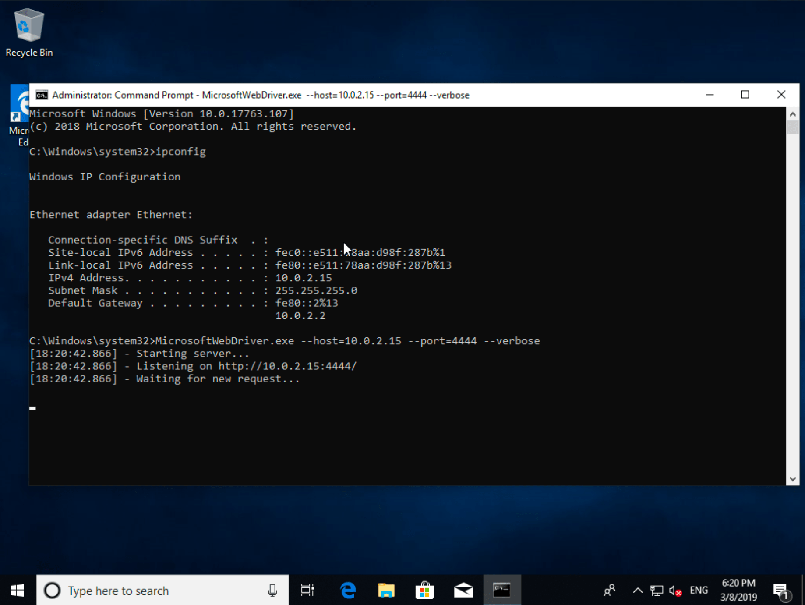

# Requirements

The only way to build windows docker images is on Linux on bare metal machine or on VM with nested virtualization enabled.
We use Ubuntu 18.04:
```
$ uname -a
Linux desktop 4.15.0-46-generic #49-Ubuntu SMP Wed Feb 6 09:33:07 UTC 2019 x86_64 x86_64 x86_64 GNU/Linux
```
```
$ ls -l /dev/kvm
crw-rw---- 1 root kvm 10, 232 мар  8 19:38 /dev/kvm
```

# Before begin

* Download Windows 10 installation CD from (Microsoft Software Download site)[https://www.microsoft.com/en-us/software-download/windows10ISO]
* Download virtio drivers (virtio-win-0.1.141.iso)[https://fedorapeople.org/groups/virt/virtio-win/direct-downloads/archive-virtio/virtio-win-0.1.141-1/virtio-win-0.1.141.iso]

Let assume that you now have two files in current directory:
```
$ ls
virtio-win-0.1.141.iso  Win10_1809Oct_English_x32.iso
```

Create hard disk image where Windows will be installed:
```
$ qemu-img create -f qcow2 hdd.img 40G
Formatting 'hdd.img', fmt=qcow2 size=42949672960 cluster_size=65536 lazy_refcounts=off refcount_bits=16
```

Then run virtual machine and begin installation:
```
$ sudo qemu-system-x86_64 -enable-kvm \
        -machine q35 -smp sockets=1,cores=1,threads=2 -m 2048 \
        -usb -device usb-kbd -device usb-tablet -rtc base=localtime \
        -net nic,model=virtio -net user,hostfwd=tcp::4444-:4444 \
        -drive file=hdd.img,media=disk,if=virtio \
        -drive file=Win10_1809Oct_English_x32.iso,media=cdrom \
        -drive file=virtio-win-0.1.141.iso,media=cdrom 
```
Windows will boot from installation cdrom:


Disable firewall

Create overlay image that will contain VM state:
```
$ qemu-img create -b hdd.img -f qcow2 snapshot.img
Formatting 'snapshot.img', fmt=qcow2 size=42949672960 backing_file=hdd.img cluster_size=65536 lazy_refcounts=off refcount_bits=16
```

Run VM using snapshot.img:
```
$ sudo qemu-system-x86_64 -enable-kvm \
        -machine q35 -smp sockets=1,cores=1,threads=2 -m 2048 \
        -usb -device usb-kbd -device usb-tablet -rtc base=localtime \
        -net nic,model=virtio -net user,hostfwd=tcp::4444-:4444 \
        -drive file=snapshot.img,media=disk,if=virtio \
        -monitor stdio
```
Please note that qemu runs with monitor connected to stdio.

Open command prompt with administrator privileges and run:
```
MicrosoftWebDriver.exe --host=10.0.2.15 --port=4444 --verbose
```

Minimize command prompt window when driver is up and running. Now we are ready to save vm state that will be used to quick browser start. Switch to terminal where qemu runs and type at qemu prompt:
```
(qemu) savevm windows
```
Then type quit to stop VM:
```
(qemu) quit
```

Now we are able to start VM from snapshot:
```
$ sudo qemu-system-x86_64 -enable-kvm \
        -machine q35 -smp sockets=1,cores=1,threads=2 -m 2048 \
        -usb -device usb-kbd -device usb-tablet -rtc base=localtime \
        -net nic,model=virtio -net user,hostfwd=tcp::4444-:4444 \
        -drive file=snapshot.img,media=disk,if=virtio \
        -loadvm windows
```

Create new browsers session using curl command:
```
$ curl http://localhost:4444/session -d  '{"capabilities": {"alwaysMtch": {"browserName":"MicrosoftEdge"}}}'
{"value":{"sessionId":"6CC53217-C889-4045-A5B3-059F2C49FDE6","capabilities":{"acceptInsecureCerts":false,"browserName":"MicrosoftEdge","browserVersion":"44.17763.1.0","pageLoadStrategy":"normal","platformName":"windows","setWindowRect":false,"timeouts":{"implicit":0,"pageLoad":300000,"script":30000},"proxy":{}}}}
```

Open url in the browser with curl (note you have to use session id from previous command:
```
$ curl http://localhost:4444/session/6CC53217-C889-4045-A5B3-059F2C49FDE6/url -d  '{"url": "http://www.whatismybrowser.com/"}'
````


```
$ mv hdd.img snapshot.img image
```
```
$ docker build -t windows/edge:18 .
```
```
$ docker run -it --rm --privileged -p 4444:4444 -p 5900:5900 windows/edge:18
```
