# Requirements

The only way to build windows docker images is on Linux, on bare metal machine or on VM with nested virtualization enabled.
We use Ubuntu 18.04:
```
$ uname -a
Linux desktop 4.15.0-46-generic #49-Ubuntu SMP Wed Feb 6 09:33:07 UTC 2019 x86_64 x86_64 x86_64 GNU/Linux
```
```
$ ls -l /dev/kvm
crw-rw---- 1 root kvm 10, 232 мар  8 19:38 /dev/kvm
```
Also, it is necessary to use the same qemu version on host where images are built and within docker image:
```
$ qemu-system-x86_64 -version
QEMU emulator version 2.11.1(Debian 1:2.11+dfsg-1ubuntu7.10)
Copyright (c) 2003-2017 Fabrice Bellard and the QEMU Project developers
```

# Before begin
* Clone repository and change dir to it:
```
$ git clone https://github.com/aerokube/windows.git
```
```
$ cd windows
```
* Download Windows 10 installation CD from [Microsoft Software Download](https://www.microsoft.com/en-us/software-download/windows10ISO) site
* Download virtio drivers [virtio-win-0.1.141.iso](https://fedorapeople.org/groups/virt/virtio-win/direct-downloads/archive-virtio/virtio-win-0.1.141-1/virtio-win-0.1.141.iso)

Let assume that you now have two files in current directory:
```
$ ls
virtio-win-0.1.141.iso  Win10_1809Oct_English_x32.iso
```
# Windows Installation
Create hard disk image where Windows will be installed:
```
$ qemu-img create -f qcow2 hdd.img 40G
```

Then run virtual machine and begin installation:
```
$ sudo qemu-system-x86_64 -enable-kvm \
        -machine q35 -smp sockets=1,cores=1,threads=2 -m 2048 \
        -usb -device usb-kbd -device usb-tablet -rtc base=localtime \
        -net nic,model=virtio -net user,hostfwd=tcp::4444-:4444 \
        -drive file=hdd.img,media=disk,if=virtio \
        -drive file=Win10_1809Oct_English_x32.iso,media=cdrom \
        -drive file=virtio-win-0.1.141.iso,media=cdrom 
```
Windows will boot from installation CD:
Install Windows from installation cdrom.
Proceed to next step:

Click Install now:
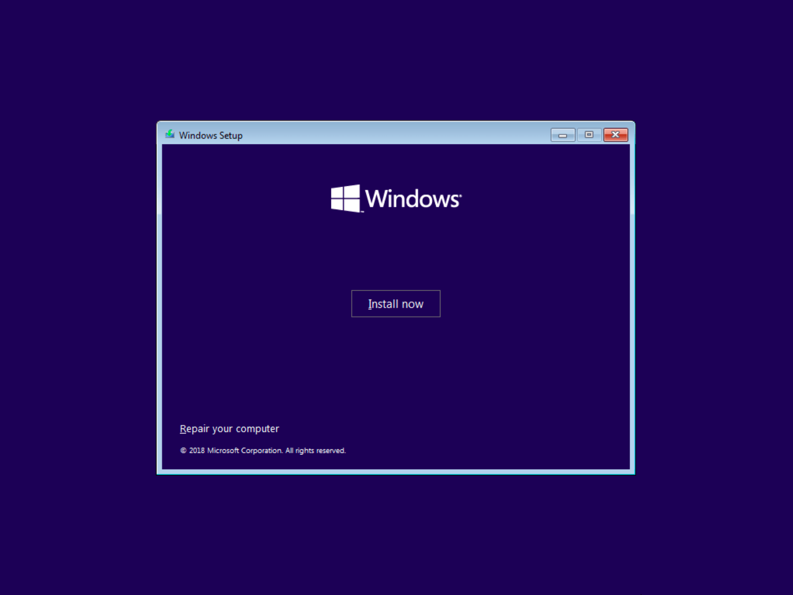
Enter license information:
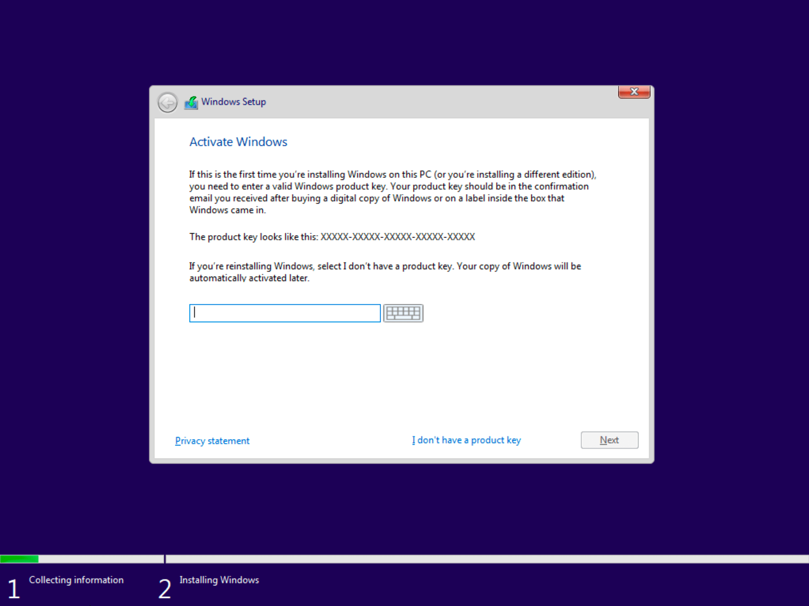
Choose edition:
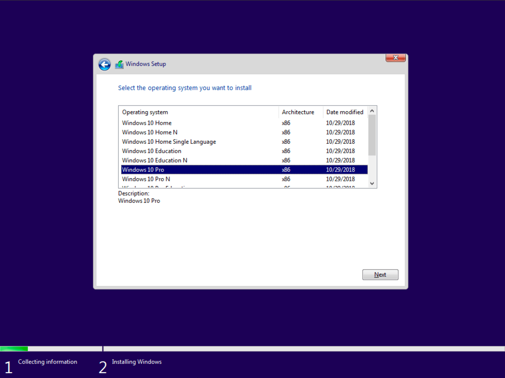
Read and accept license agreement:
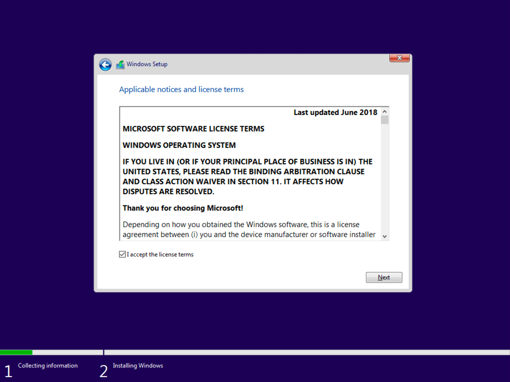
Choose custom installation type:

Now you have to install virtio storage driver. Click Load driver:

Point to E:\viostor\w10\x86 directory:
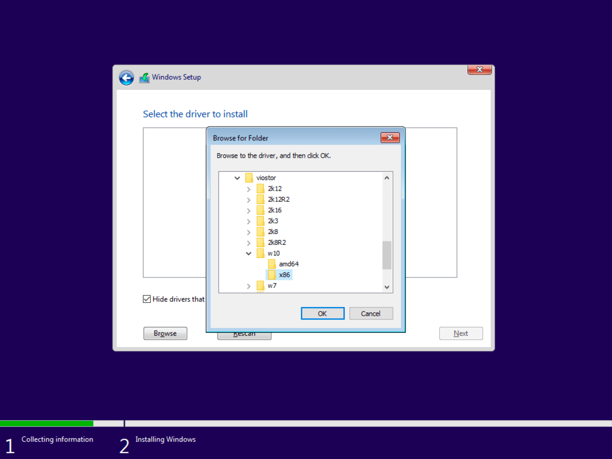
Click next to install driver:
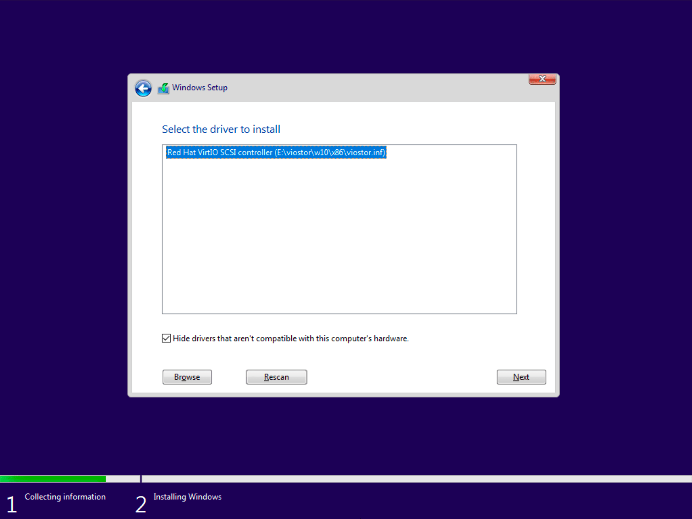
Choose installation partition and click next:
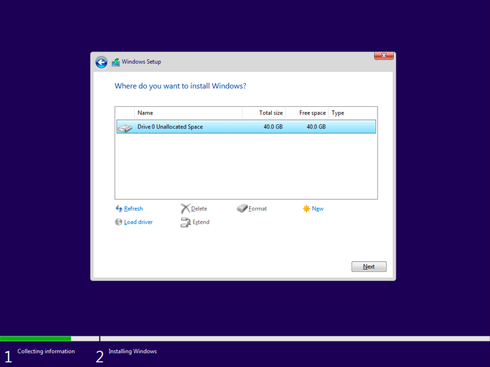
Wait while installation finishes:
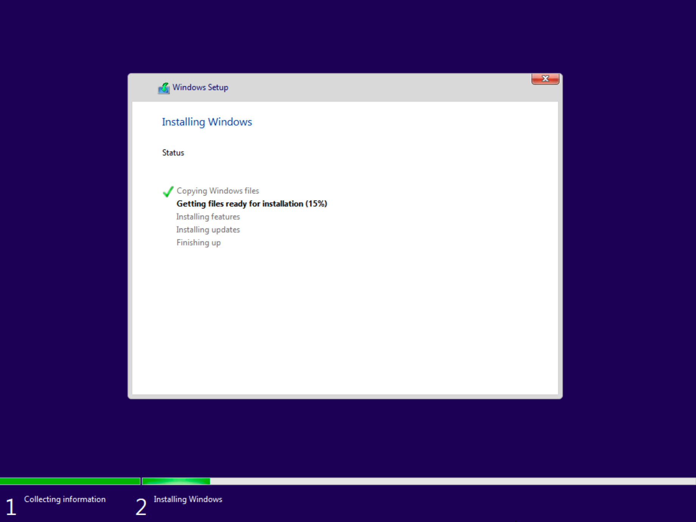
Setup user and password, also set three security questions, and other post install configurations until you get Windows installed:

Now you have to install ethernet virtio driver. Open device manager and click Update driver:
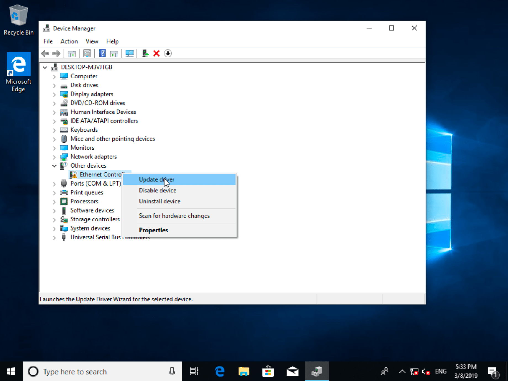
Choose virtio cdrom and click OK:

Install driver:

Connect to network:

To be able to access webdriver server you have to disable windows firewall or setup firewall rule to open 4444 port:


Now configure your system as you wish, install updates etc. Download IE driver from [here](https://www.seleniumhq.org/download/) and put it to ```C:\Windows\System32``` directory.

To setup Edge driver open command prompt as administrator and type:
```
DISM.exe /Online /Add-Capability /CapabilityName:Microsoft.WebDriver~~~~0.0.1.0
```
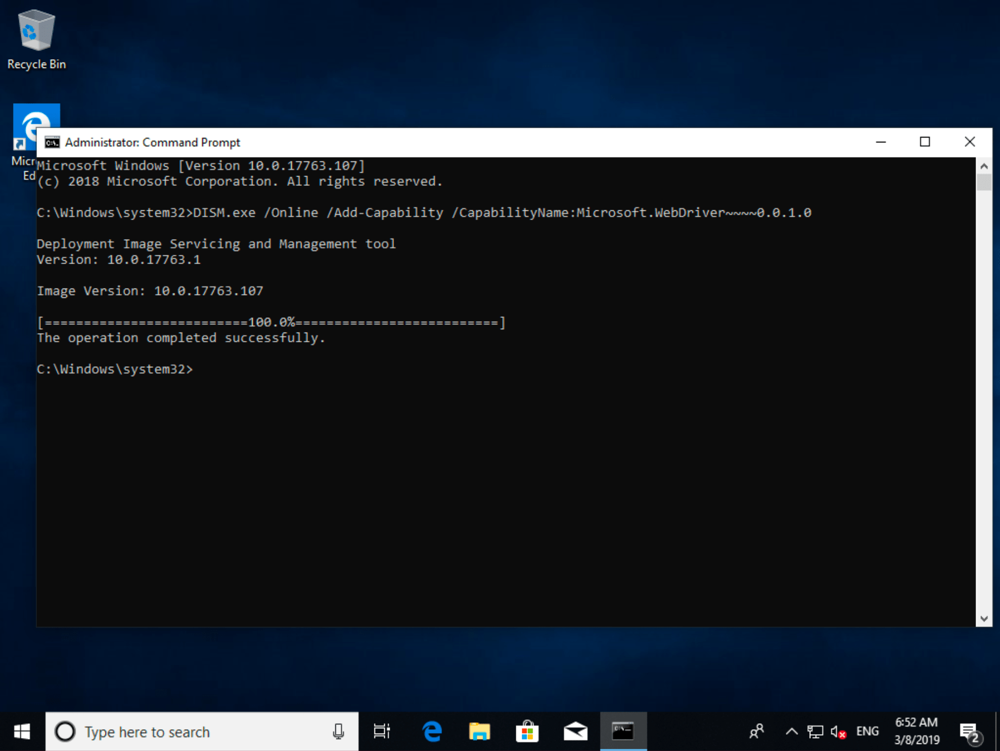

Shutdown VM.

# Quick boot
Now we are ready to create VM state and use it to quick driver start.

Create overlay image that will contain VM state:
```
$ qemu-img create -b hdd.img -f qcow2 snapshot.img
```
Run VM using snapshot.img:
```
$ sudo qemu-system-x86_64 -enable-kvm \
        -machine q35 -smp sockets=1,cores=1,threads=2 -m 2048 \
        -usb -device usb-kbd -device usb-tablet -rtc base=localtime \
        -net nic,model=virtio -net user,hostfwd=tcp::4444-:4444 \
        -drive file=snapshot.img,media=disk,if=virtio \
        -monitor stdio
```
Please note that qemu runs with monitor connected to stdio.

# Microsoft Edge
Open command prompt with administrator privileges and run:
```
MicrosoftWebDriver.exe --host=10.0.2.15 --port=4444 --verbose
```

# Internet Explorer
Open command prompt as unprivileged user and run:
```
C:\Windows\System32\IEDriverServer.exe --host=0.0.0.0 --port=4444 --log-level=DEBUG
```
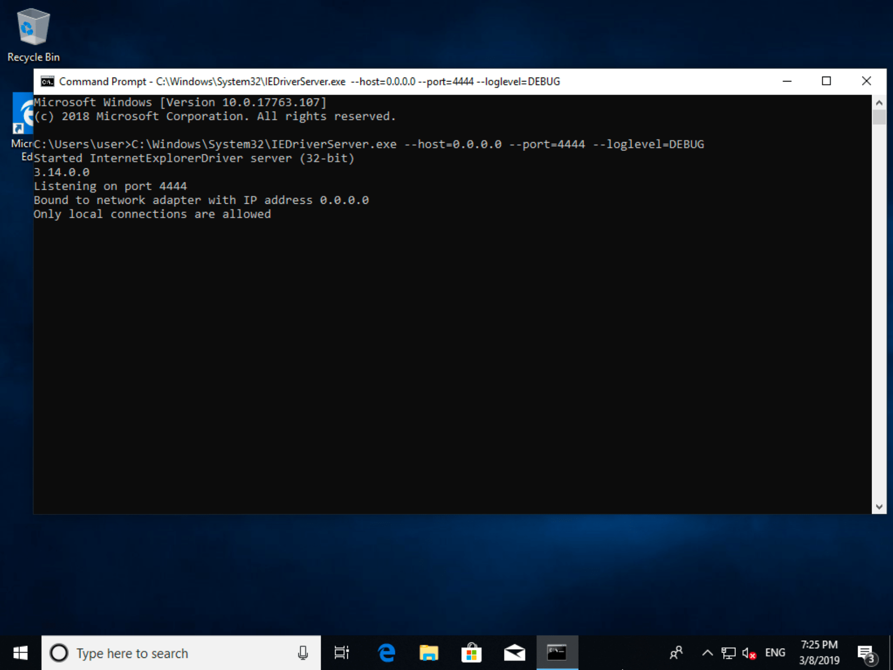
Minimize command prompt window when driver is up and running. Now we are ready to save vm state that will be used to quick browser start. Switch to terminal where qemu runs and type at qemu prompt:
```
(qemu) savevm windows
```
Then type quit to stop VM:
```
(qemu) quit
```

Now we are able to start VM from snapshot:
```
$ sudo qemu-system-x86_64 -enable-kvm \
        -machine q35 -smp sockets=1,cores=1,threads=2 -m 2048 \
        -usb -device usb-kbd -device usb-tablet -rtc base=localtime \
        -net nic,model=virtio -net user,hostfwd=tcp::4444-:4444 \
        -drive file=snapshot.img,media=disk,if=virtio \
        -loadvm windows
```
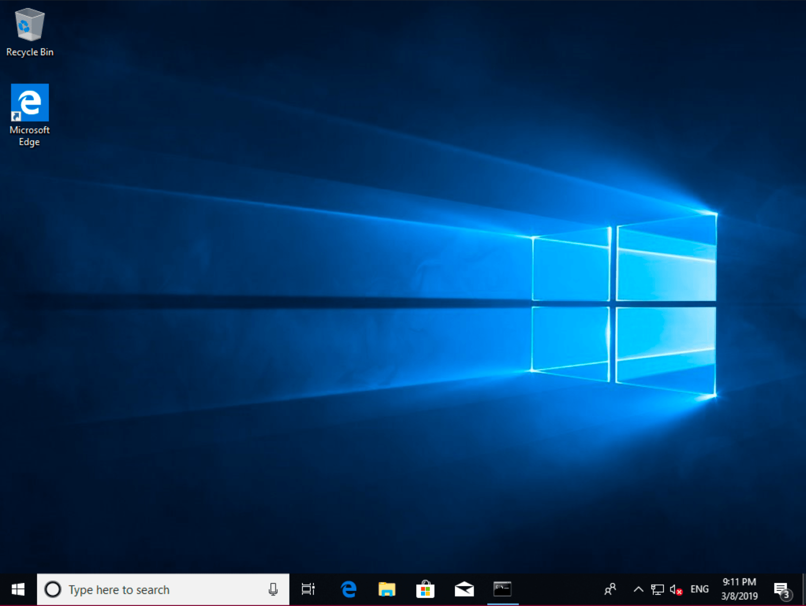

## Docker Image
Move filesystem and state files to image directory:
```
$ mv hdd.img snapshot.img image
```
```
$ cd image
```
For Microsoft Edge build image with:
```
$ docker build -t windows/edge:18 .
```
For Internet Explorer use:
```
$ docker build -t windows/ie:11 .
```
Now we can run windows containers:
```
$ docker run -it --rm --privileged -p 4444:4444 -p 5900:5900 windows/edge:18
```
```
$ docker run -it --rm --privileged -p 4444:4444 -p 5900:5900 windows/ie:11
```
Connect to ```vnc://localhost:5900``` using **selenoid** as password or run tests against ```http://localhost:4444```


