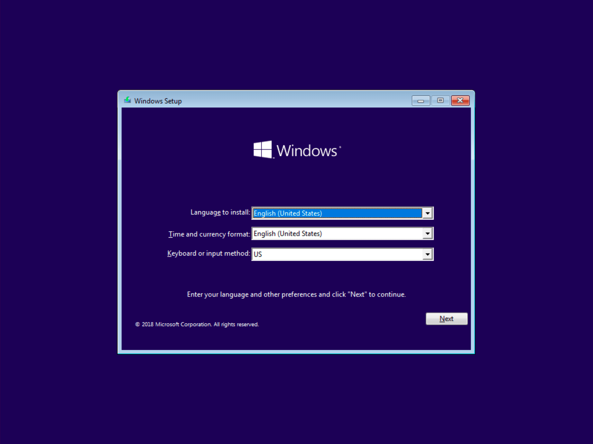
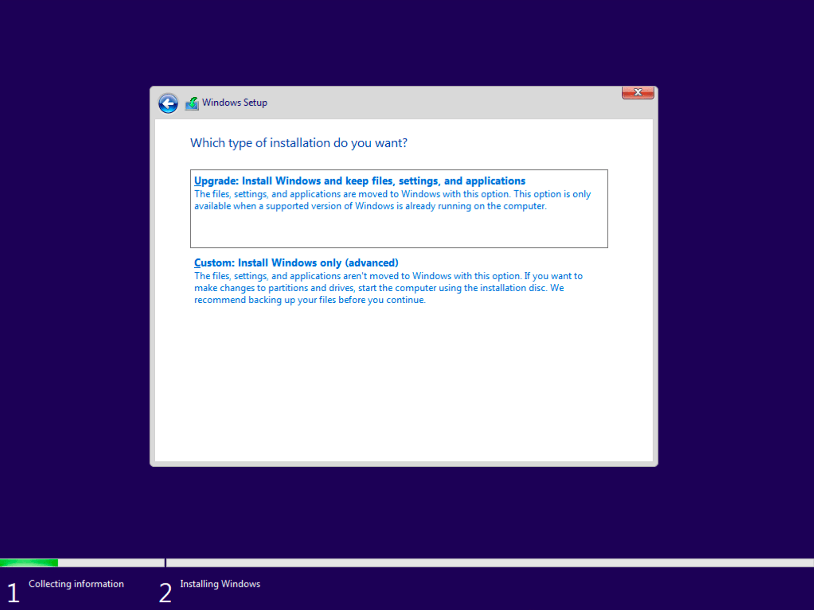
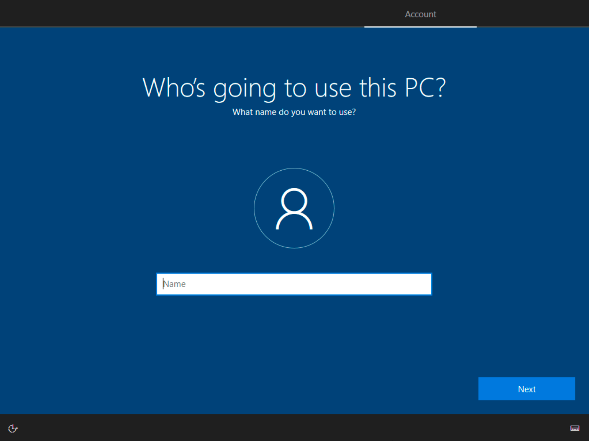
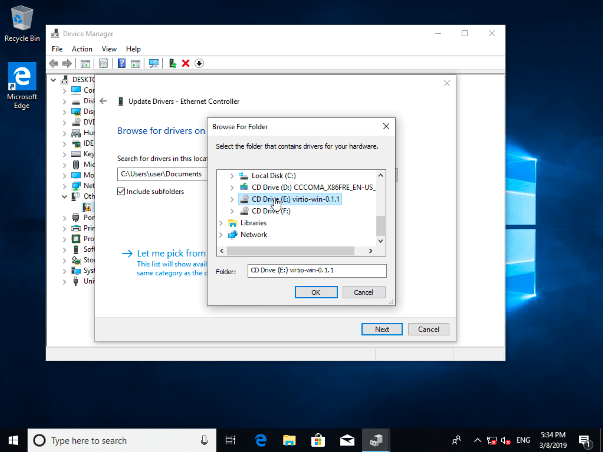
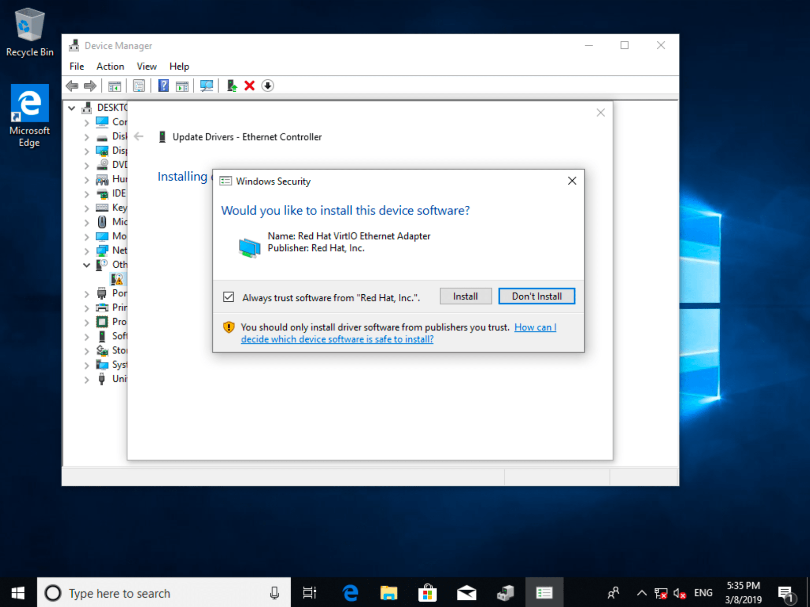
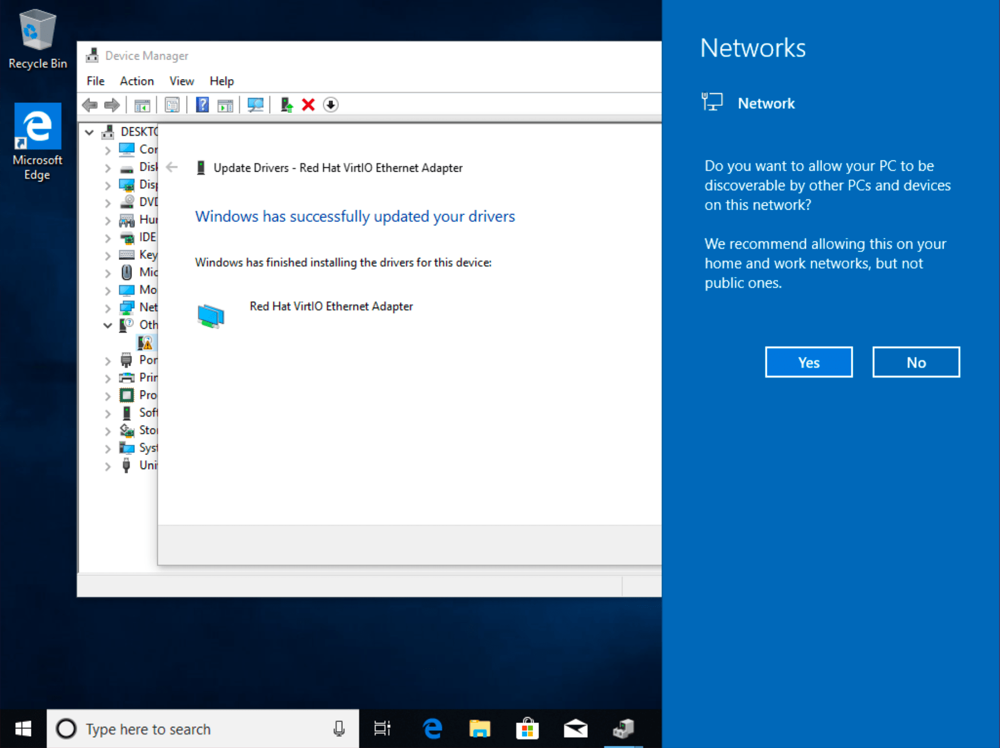
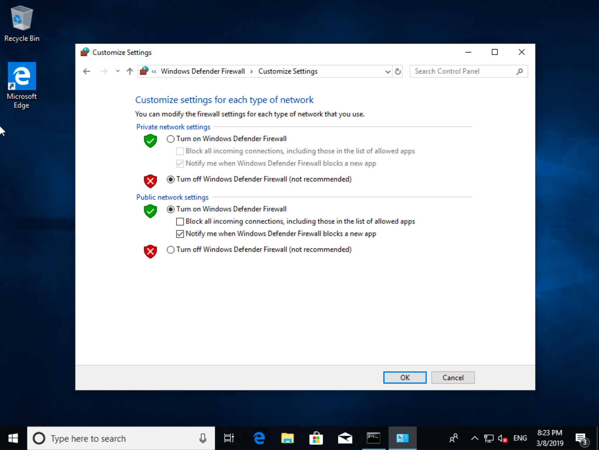
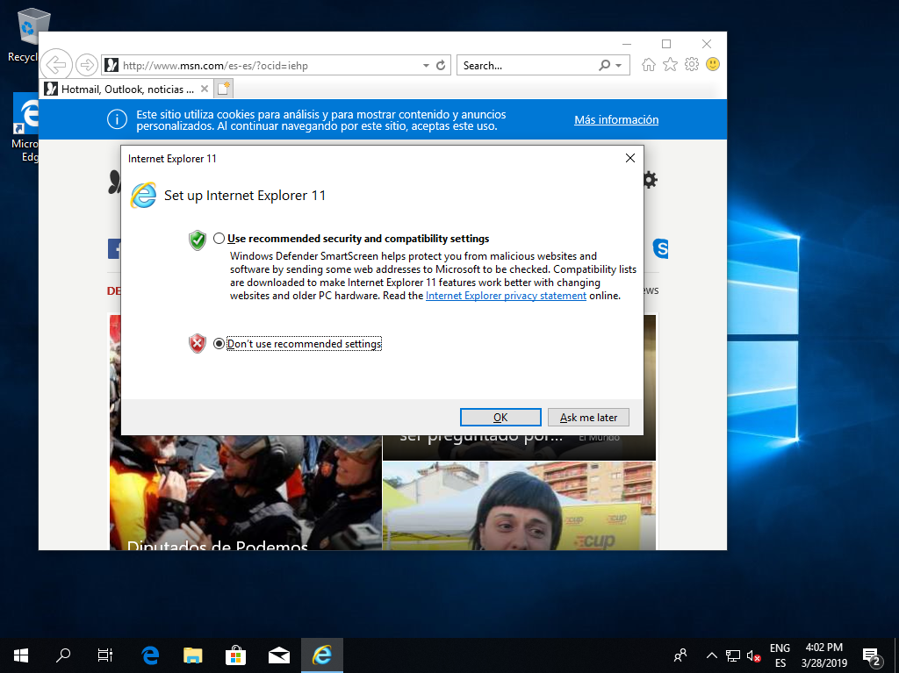
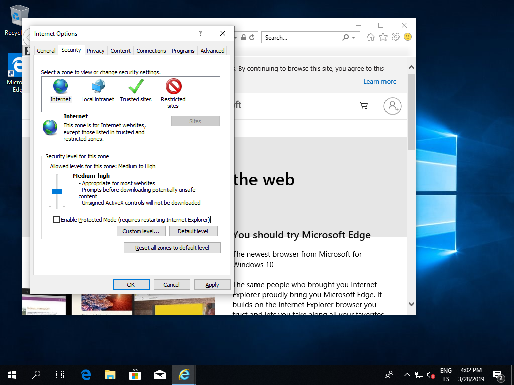

# Windows Images

This repository contains build instructions and Dockerfile to build Docker images with Windows-only browsers: `Internet Explorer` and `Microsoft Edge`. 

## System Requirements

1) Bare metal machine or on VM with nested virtualization enabled and Linux installed. This example was tested on `Ubuntu 18.04`.
```
$ uname -a
Linux desktop 4.15.0-46-generic #49-Ubuntu SMP Wed Feb 6 09:33:07 UTC 2019 x86_64 x86_64 x86_64 GNU/Linux
```
To check that virtualization is supported - verify that `/dev/kvm` file is present:
```
$ ls -l /dev/kvm
crw-rw---- 1 root kvm 10, 232 мар  8 19:38 /dev/kvm
```

2) [Qemu](https://www.qemu.org/) machine emulator installed. It is important to use the same `qemu` version on host machine where images are built and inside Docker image. To check `qemu` version type:
```
$ qemu-system-x86_64 -version
QEMU emulator version 2.11.1(Debian 1:2.11+dfsg-1ubuntu7.10)
Copyright (c) 2003-2017 Fabrice Bellard and the QEMU Project developers
```

3) Windows license key

## Build Procedure
### 1. Preparative Steps
1.1) Clone this repository and change dir to it:
```
$ git clone https://github.com/aerokube/windows-images.git
$ cd windows-images
```
1.2) Download **Windows 10** installation image from [Microsoft Software Download](https://www.microsoft.com/en-us/software-download/windows10ISO) website.
1.3) Download **virtio** drivers [virtio-win-0.1.141.iso](https://fedorapeople.org/groups/virt/virtio-win/direct-downloads/archive-virtio/virtio-win-0.1.141-1/virtio-win-0.1.141.iso). In the next steps we assume that you now have two files in current directory:
```
$ ls
virtio-win-0.1.141.iso  Win10_1809Oct_English_x32.iso
```

### 2. Windows Installation
2.1) Create hard disk image where Windows will be installed:
```
$ qemu-img create -f qcow2 hdd.img 40G
```

2.2) Run virtual machine and begin installation:
```
$ sudo qemu-system-x86_64 -enable-kvm \
        -machine q35 -smp sockets=1,cores=1,threads=2 -m 2048 \
        -usb -device usb-kbd -device usb-tablet -rtc base=localtime \
        -net nic,model=virtio -net user,hostfwd=tcp::4444-:4444 \
        -drive file=hdd.img,media=disk,if=virtio \
        -drive file=Win10_1809Oct_English_x32.iso,media=cdrom \
        -drive file=virtio-win-0.1.141.iso,media=cdrom 
```

2.3) Windows will boot from installation image. Install Windows.

2.3.1) Proceed to the next step:


2.3.2) Click **Install now**:


2.3.3) Enter license key:


2.3.4) Choose Windows edition:


2.3.5) Read and accept license agreement:


2.3.6) Choose custom installation type:


2.3.7) Now you have to install **virtio storage driver**. Click **Load driver**:


2.3.8) Point to `E:\viostor\w10\x86` directory:


2.3.9) Click next to install driver:


2.3.10) Choose installation partition and click next:


2.3.11) Wait while installation finishes:


2.3.12) Setup user and password:


2.3.13) Do other post-install configuration steps until you get Windows installed:


2.3.14) Install **Ethernet virtio driver**. Open device manager and click **Update driver**:

Choose virtio cdrom and click OK:

Install driver:

Connect to network:


2.3.15) Disable **Windows Firewall** or add firewall rule to allow access to port **4444**. This is needed to access webdriver binary port with Selenium test.


2.3.16) Configure Windows as you wish: install updates, change screen resolution, apply registry modifications and so on.

### 3. Adding WebDriver Binaries
These binaries will handle Selenium test requests and launch respective browser. 

* For **Internet Explorer** - download an archive with driver binary from [Selenium official website](https://www.seleniumhq.org/download/), unpack it and put the binary to ```C:\Windows\System32``` directory.

* For **Microsoft Edge** web driver binary can be installed with the following command:
```
> DISM.exe /Online /Add-Capability /CapabilityName:Microsoft.WebDriver~~~~0.0.1.0
```


### 4. Creating Quick Boot Memory Snapshot
This snapshot contains memory state and is needed to quickly restore virtual machine instead of doing full boot which is slow. To create it:

4.1) Shutdown virtual machine.

4.2) Create overlay image that will contain VM state:
```
$ qemu-img create -b hdd.img -f qcow2 snapshot.img
```

4.3) Run VM using snapshot.img as filesystem:
```
$ sudo qemu-system-x86_64 -enable-kvm \
        -machine q35 -smp sockets=1,cores=1,threads=2 -m 2048 \
        -usb -device usb-kbd -device usb-tablet -rtc base=localtime \
        -net nic,model=virtio -net user,hostfwd=tcp::4444-:4444 \
        -drive file=snapshot.img,media=disk,if=virtio \
        -monitor stdio
```
Please note that `qemu` runs with monitor connected to stdio.

4.4) Browser configuration (required only for **Internet Explorer**).

Open **Internet Explorer**. The first time this browser is launched, it asks for the security setup. The option "Don't use recommended settings" need to be selected as follows:



Then, the Internet Options have to be changed. These options can be opened using the configuration button located at the top of Internet Explorer. In the tab "Security", the protect mode for the zones "Internet" and "Restricted sites" have to be disabled, as shown in the following picture:



At this point, you have to close Internet Explorer. Select the option "Always close all tabs" when Internet Explorer is closing. Finally, you have to open again Internet Explorer and double check that the protected mode is turned off (it can be seen in a message box at the bottom of the browser).

4.5) Run web driver binary command.

* For **Microsoft Edge** - open command prompt **with administrator privileges** and run:
```
> MicrosoftWebDriver.exe --host=10.0.2.15 --port=4444 --verbose
```


* For **Internet Explorer** - open command prompt **as unprivileged user** and run:
```
> C:\Windows\System32\IEDriverServer.exe --host=0.0.0.0 --port=4444 --log-level=DEBUG
```


4.6) Minimize command line prompt window when driver is up and running.
 
4.7) Switch to terminal where **qemu** runs and type at qemu prompt:
```
(qemu) savevm windows
```
Then type quit to stop VM:
```
(qemu) quit
```
To start VM from snapshot manually use the following command:
```
$ sudo qemu-system-x86_64 -enable-kvm \
        -machine q35 -smp sockets=1,cores=1,threads=2 -m 2048 \
        -usb -device usb-kbd -device usb-tablet -rtc base=localtime \
        -net nic,model=virtio -net user,hostfwd=tcp::4444-:4444 \
        -drive file=snapshot.img,media=disk,if=virtio \
        -loadvm windows
```
The command above is used in `Dockerfile` entry point script.


### 5. Build Docker Image

5.1) Move filesystem and state files to `image` directory in this repository:
```
$ mv hdd.img snapshot.img image
$ cd image
```
5.2) Build Docker image using provided Dockerfile:
```
$ docker build -t windows/edge:18 . # For Microsoft Edge
```
For Internet Explorer use:
```
$ docker build -t windows/ie:11 . # For Internet Explorer
```

5.3) Run a container from image:
```
$ docker run -it --rm --privileged -p 4444:4444 -p 5900:5900 windows/edge:18 # For Microsoft Edge
$ docker run -it --rm --privileged -p 4444:4444 -p 5900:5900 windows/ie:11 # For Internet Explorer
```

5.4) To see Windows screen inside running container - connect to ```vnc://localhost:5900``` using **selenoid** as password.

5.5) To run Selenium tests - use ```http://localhost:4444``` as Selenium URL.


